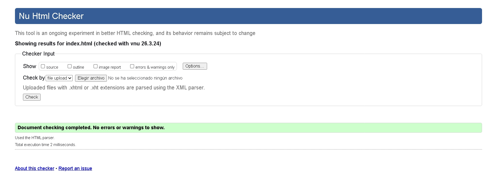

# Proyecto Web Grupal - Web-1-s

Este repositorio contiene nuestro proyecto web grupal. Hemos desarrollado este sitio siguiendo todos los requerimientos solicitados para la evaluación, consolidando el trabajo de todo el equipo en una sola página funcional y validada.

## Host de la página web

> https://web-1-s.jjln6i.easypanel.host/

## 📌 Requerimientos Cumplidos

A lo largo del desarrollo de este proyecto, nos aseguramos de completar cada una de las tareas asignadas:

*   **Registro del equipo:** Hemos registrado oficialmente a nuestro grupo y seleccionado nuestro estándar en la hoja de cálculo correspondiente.
*   **Perfiles Individuales (`me.html`):** Cada integrante del equipo ha diseñado su propia sección. En ella, cada uno incluyó al menos un pasatiempo favorito acompañado de imágenes representativas.
*   **Formulario Grupal:** Implementamos una sección de "Contáctame" que funciona a nivel grupal, permitiendo a los usuarios comunicarse con el equipo.

## 🎨 Estándares CSS y Diseño

Para el diseño del sitio, nos basamos en los estándares web actuales. Específicamente, trabajamos con el siguiente estándar, el cual reservamos previamente:
> **Estándar CSS elegido**

**Nota:** Además de implementar este estándar de forma práctica en nuestro código, **se ha incluido una sección explicativa dentro de la misma página web**. Allí detallamos en qué consiste este estándar.

## 🛠️ Revisiones y Calidad del Código (W3C)

Nos tomamos muy en serio la calidad y semántica de nuestro código. Por ello, pasamos por un riguroso proceso de validación:

1.  **Validación HTML:** El proyecto fue analizado exhaustivamente en [validator.w3.org](https://validator.w3.org/).
2.  **Validación CSS:** Usamos la herramienta oficial del W3C para comprobar que nuestra hoja de estilos cumple con las normativas.
3.  **Control de Versiones (Commits):** Si exploras nuestro historial de Git, notarás que fuimos detallistas con las correcciones. **Por cada observación o error que nos arrojó el validador, hicimos un commit específico solucionándolo**, dejando un registro claro de la evolución y limpieza del código.

## 👥 Integrantes del Equipo

*   Miguel Angel Flores Leon - *Leder 🧑‍💼*
*   Abimael Ernesto Frontado Fajardo - *Gaymer pro de Mobile Legends 📱*
*   Jhordan Steven Huamani Huamani - *Owner of infome 📋*
*   Jorge Luis Ortiz Castañeda - *Leder2 👨‍💼*
*   Adrian Alexander Arenas Cutipa - *QA 🫎*

---

  <i>Proyecto desarrollado para la clase de Ingeniería web - 2026</i>

